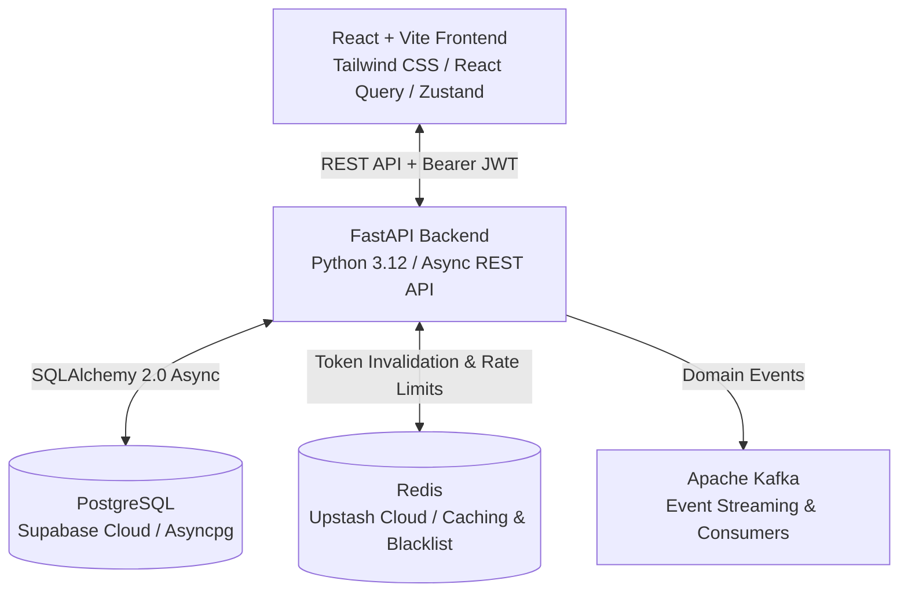

# TaskForge ⚡

TaskForge is a modern, full-stack, real-time Agile Project Management & Jira-alternative platform engineered for engineering teams that ship fast. Built with **FastAPI**, **React + Vite**, **PostgreSQL (Supabase)**, **Redis (Upstash)**, and **Apache Kafka**.

---

## 🌟 Comprehensive Feature Overview

### 1. 🏢 Multi-Tenant Organizations & Workspaces
- **Workspace Creation & Management**: Create multiple standalone organizations to segregate team operations and projects.
- **8-Character Secure Invite Codes**: Instant onboarding via unique, shareable join codes (`POST /join`).
- **Granular Role-Based Access Control (RBAC)**:
  - **Admin**: Full workspace configuration, member role management, project deletion, and deep audit log access.
  - **Project Manager (PM)**: Create and configure projects, plan/start/complete sprints, and manage issues.
  - **Developer**: Create, assign, comment, estimate, and transition issues through workflows.
  - **Viewer**: Read-only access across boards, backlogs, and compact activity summaries.
- **Member Directory & Role Elevation**: Live member list with one-click role upgrades/downgrades and removals.
- **Safe Deletion Safeguards**: Double-confirmation danger zone for deleting projects and workspaces.

---

### 2. 📋 Interactive Kanban Board & Workflow Engine
- **Workflow Columns**: `TODO` ➔ `IN_PROGRESS` ➔ `IN_REVIEW` ➔ `DONE`.
- **Portrait & Landscape Responsive Modes**:
  - **Desktop**: Full 4-column side-by-side Kanban grid.
  - **Mobile**: Dynamic segmented column switcher (`All Columns`, `Todo`, `In Progress`, `In Review`, `Done`) with full-width portrait cards.
- **Optimistic Concurrency Control (OCC)**: Built-in integer version tracking (`version`) preventing race conditions and silent overwrites during simultaneous team movements.
- **Issue Card Details**:
  - Auto-generated issue keys (e.g., `TF-001`, `PROJ-042`).
  - Color-coded issue types (`BUG`, `FEATURE`, `TASK`, `STORY`).
  - Priority badges (`LOW`, `MEDIUM`, `HIGH`, `URGENT`).
  - Assignee initials avatar and custom workspace label tags.
- **Instant Search & Quick-Create**: Filter cards on the fly by title, key, or assignee, and quick-add tasks directly to any column.

---

### 3. 🏃 Agile Sprint Planning & Analytics
- **Sprint Lifecycle Management**: Create sprints with customized goal statements, start dates, and end dates.
- **Sprint States**: `PLANNED` ➔ `ACTIVE` ➔ `COMPLETED`.
- **Real-Time Sprint Metrics**:
  - Dynamic completion progress bar and percentages.
  - Issue distribution counters (Total, Done, In Progress, Open).
  - Total story points / estimation delivery tracking.
- **Sprint Backlog Assignment**: Seamless modal to pull backlog tasks directly into an active or upcoming sprint.
- **Sprint Completion Workflow**: Archive completed tasks and automatically roll over remaining open issues.

---

### 4. 📦 Backlog & "Assigned to Me" Task Hub
- **Dual Scope Views**:
  - **Assigned to Me**: Dedicated personal command center for tasks assigned directly to the logged-in user.
  - **Project Backlog**: Complete unfiltered inventory of unassigned and uncompleted project tasks.
- **Horizontal Scrolling Priority Pills**: Filter in 1 click across `All`, `Urgent`, `High`, `Medium`, and `Low` with live counts.
- **Multi-Filter Support**: Filter by status (`TODO`, `IN_PROGRESS`, `IN_REVIEW`, `DONE`), issue type, and keyword search.

---

### 5. 💬 Issue Detail Drawer, Comments & Collaboration
- **Slide-in Detail Drawer**: Comprehensive side drawer without losing page context.
- **Rich Task Metadata**:
  - Editable title, description, type, priority, and status.
  - Assignee assignment/reassignment dropdown with project team members.
  - Sprint association and due date selector.
- **Threaded Comments Stream**: Real-time comments timeline with user avatars and relative timestamps.
- **Label Tagging System**: Tag issues with categorized organization labels.

---

### 6. 📊 Real-Time Metrics Dashboard
- **Workspace Overview**: High-level statistical cards showing:
  - Total Active Projects.
  - Open Issues vs Completed Issues.
  - Active Sprint Completion Rate.
  - Priority Breakdown (Urgent, High, Medium, Low).
- **Recent Activity Feed**: Real-time snapshot of the latest actions taken across team projects.

---

### 7. 🔔 Live Notifications & Glassmorphic Toast Popups
- **Event-Driven Alerts**: Instant notifications triggered on:
  - Issue assignment (`ISSUE_ASSIGNED`).
  - Status transitions (`ISSUE_STATUS_CHANGED`).
  - Comments added (`COMMENT_ADDED`).
  - Sprint lifecycle events (`SPRINT_STARTED`, `SPRINT_COMPLETED`).
- **Glassmorphic Toast Popups**: Slide-in animated toasts with auto-dismiss and direct click-through navigation.
- **Notification Center Drawer**: Dropdown menu tracking unread counts, mark-all-as-read, and full history.

---

### 8. 📜 Tiered Audit Trail Explorer
- **Immutable Event Log**: Complete history of every entity created, updated, moved, or deleted.
- **Tiered Role Access**:
  - **All Team Members**: Clean, readable humanized summaries with entity badges.
  - **Admins Only**: Expandable **`Expand ▼`** view showing structured JSON diffs (`old_value` vs `new_value`), resource IDs, and exact timestamps.

---

### 9. 📱 Mobile-First Responsive Design & Aesthetics
- **Mobile Bottom Navigation Bar**: 1-tap switching between `Dashboard`, `Organizations`, `Board`, `Backlog`, and `Sprints`.
- **Slide-Out Mobile Drawer**: Collapsible navigation with dark backdrop blur.
- **Animated Shimmer Skeletons**: Zero layout shifts with smooth skeleton loaders on Sprints, Boards, Backlog, Dashboard, and Orgs.
- **Rich Aesthetic Design**: Custom dark-mode color tokens, glowing glassmorphic elements, and sleek typography.

---

## 🛠️ Tech Stack & Architecture



### Backend
- **FastAPI**: Asynchronous Python web framework with OpenAPI / Swagger documentation.
- **SQLAlchemy 2.0 (Async) + asyncpg**: Modern asynchronous ORM.
- **PostgreSQL 16 / Supabase**: Persistent relational database with connection pooling.
- **Redis 7 / Upstash**: Cache acceleration, JWT refresh token blacklisting, and rate limiting.
- **Apache Kafka + aiokafka**: Domain event pub/sub architecture.
- **Alembic**: Database migrations & schema version management.
- **Pytest + pytest-asyncio**: Comprehensive automated backend test suite.

### Frontend
- **React 18 + TypeScript + Vite**: Modern, responsive Single Page Application (SPA).
- **Tailwind CSS**: Custom dark mode UI theme.
- **@tanstack/react-query**: Server state management, optimistic UI updates, and stale-while-revalidate caching.
- **Zustand**: Client authentication and workspace context persistence.

---

## 🚀 Deployment Architecture

| Component | Provider | Live URL |
| :--- | :--- | :--- |
| **Frontend (SPA)** | Vercel | [https://taskforge-opal.vercel.app](https://taskforge-opal.vercel.app) |
| **Backend (API)** | Render | [https://taskforge-fg4u.onrender.com](https://taskforge-fg4u.onrender.com) |
| **Database** | Supabase Cloud | PostgreSQL 16 Pooler |
| **Cache & Redis** | Upstash | Redis Cloud |

---

## 💻 Local Development Setup

### Prerequisites
- Python 3.9+ / 3.12
- Node.js 18+ & npm
- Docker & Docker Compose (optional for full-stack containerization)

### 1. Backend Setup
```bash
cd backend
python3 -m venv .venv
source .venv/bin/activate
pip install -r requirements.txt

# Run migrations
alembic upgrade head

# Start development server
uvicorn app.main:app --host 0.0.0.0 --port 8000 --reload
```

### 2. Frontend Setup
```bash
cd frontend
npm install
npm run dev
```
Open **[http://localhost:5173](http://localhost:5173)** in your browser.

---

## 🐳 Full Stack Docker Setup

To run the complete platform locally with Docker Compose:

```bash
docker compose up -d --build
```

Access points:
- **Frontend App**: [http://localhost:3000](http://localhost:3000)
- **API Documentation**: [http://localhost:8000/docs](http://localhost:8000/docs)
- **API Health Check**: [http://localhost:8000/api/v1/health](http://localhost:8000/api/v1/health)

---

## 🧪 Running Automated Tests

Run the full pytest suite:
```bash
cd backend
.venv/bin/pytest app/tests/ -v
```

---

## 📄 License
MIT License. Created for modern engineering teams.
